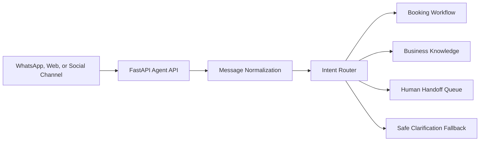

# AI Customer Service Agent Demo

A safe, production-style FastAPI demonstration of an AI-assisted customer
service router. It identifies customer intent, chooses the next workflow action,
and escalates uncertain or sensitive conversations to a human.

The demo runs locally without an API key, so reviewers can test it immediately.

## Supported intents

- Create an appointment
- Cancel an appointment
- Reschedule an appointment
- Ask a business question
- Request a human team member
- Unknown intent with safe fallback

## Architecture



## Safety behavior

- Explicit requests for a person are prioritized
- Unknown messages do not trigger business actions
- Low-confidence requests fall back to clarification and human support
- Input length and structure are validated with Pydantic
- The demo contains no customer data, credentials, or private production logic

## Run locally

```bash
python -m venv .venv
source .venv/bin/activate  # Windows: .venv\Scripts\activate
pip install -r requirements.txt
uvicorn app.main:app --reload
```

Open:

- Swagger UI: `http://localhost:8000/docs`
- Health check: `http://localhost:8000/health`

## Run with Docker

```bash
docker compose up --build
```

## Example

```bash
curl -X POST http://localhost:8000/agent/respond \
  -H "Content-Type: application/json" \
  -d '{"message":"Please reschedule my appointment for another day."}'
```

Example response:

```json
{
  "intent": "reschedule_appointment",
  "confidence": 0.82,
  "reply": "I can help find a new time for your existing appointment.",
  "requires_human": false,
  "next_action": "request_appointment_reference",
  "matched_terms": ["reschedule", "another day"]
}
```

## Test

```bash
pytest
```

## Extension path

The deterministic router can be replaced by an LLM classifier while keeping the
same response contract, safety checks, workflow actions, tests, and human-handoff
behavior.
